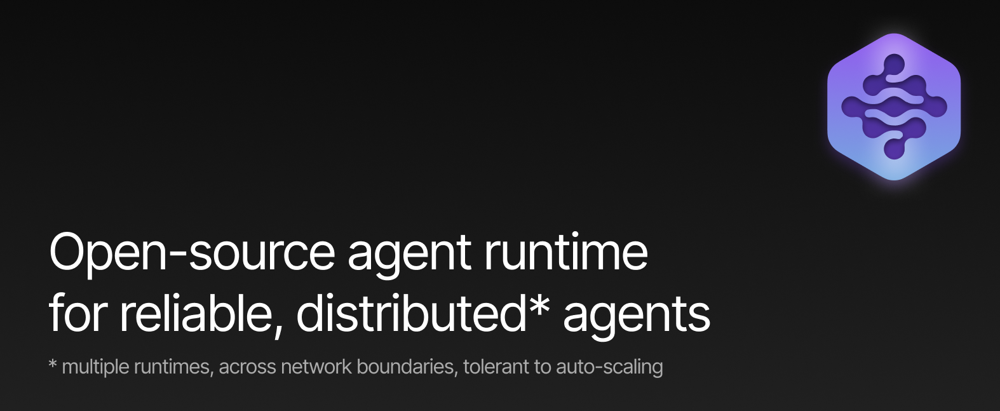
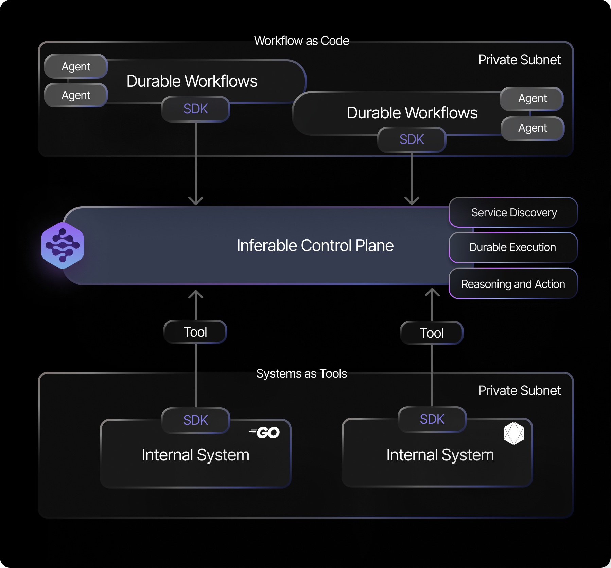

 

  

# The Problem

Building reliable AI agents at scale is hard.

- 💽 **State management**: Unless we run everything in one process and in-memory, we need to manage distributed state.

- ⛔️ **Fault tolerance**: Distributed tools mean we need to manage network failures, and coordinate between agents and tools running on different machines.

- 🧑‍💻 **Human in the loop**: We don't want AI to be completely autonomous. We want to build abstractions that help humans intervene.

- 🔄 **Point-in-time consistency**: Even if we've got all of this working, distributed systems are inherently unreliable. And so are the agents running on them.

# The Solution

- 🤖 **[Managed Agent Runtime](https://docs.inferable.ai/pages/runs)**: Managed [ReAct](https://www.promptingguide.ai/techniques/react)-like agent runtime powered by your own functions.

- ⚡️ **[Durable Tool Calling](https://docs.inferable.ai/pages/functions)**: Durable execution engine helps agents recover from tool-calling failures, load balance across your compute, and caches results for fast re-runs.

- 🛡️ **[Zero Network Config](https://docs.inferable.ai/pages/no-incoming-connections)**: No inbound connections or networking config required. Everything works via long-polling pub-sub.

- 🔌 **Multiple Language Support**: Native SDKs for TypeScript, Go, .NET and more coming soon - integrate with your existing codebase in minutes.

- ✨ **Fully open-source and self-hostable**: Inferable is 100% open-source, MIT licensed, and self-hostable. We also offer a managed service with high availability and a generous free tier.

## Get Started

Check out our [quick start guide](https://docs.inferable.ai/pages/quick-start) for a step-by-step guide on how to get started.

## Self hosting

Inferable is 100% open-source and self-hostable:

- [Self hosting guide](https://docs.inferable.ai/pages/self-hosting)

## Language support

- [Node.js / TypeScript](./sdk-node/README.md) ([Quick start](./sdk-node/README.md#quick-start))
- [Go](./sdk-go/README.md) ([Quick start](./sdk-go/README.md#quick-start))
- [.NET](./sdk-dotnet/README.md) ([Quick start](./sdk-dotnet/README.md#quick-start))
- [React](./sdk-react/README.md) ([Quick start](./sdk-react/README.md#quick-start))

## Documentation

For comprehensive documentation on using Inferable AI, please visit our [official documentation](https://docs.inferable.ai/).

## Contributing

We welcome contributions to all projects in the Inferable repository. Please read our [contributing guidelines](./CONTRIBUTING.md) before submitting any pull requests.

## License

All code in this repository is licensed under the MIT License.
