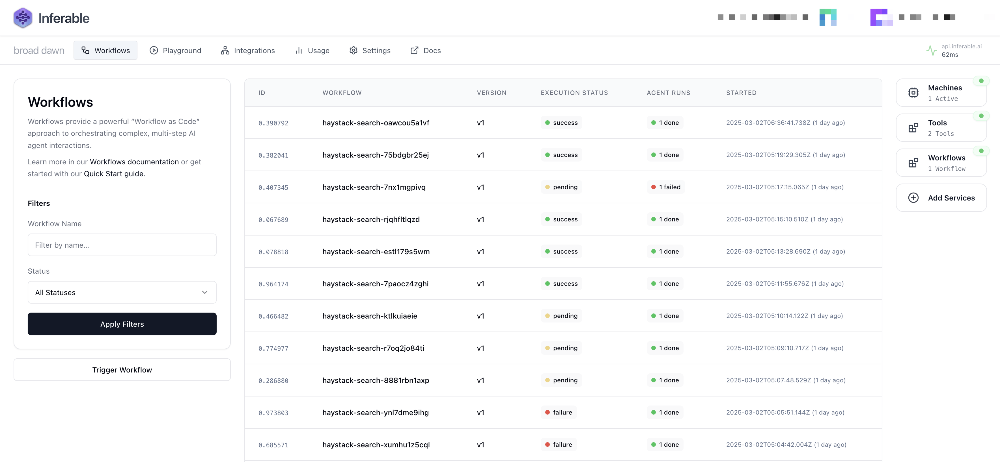

<div align="center">


# Inferable

The managed LLM-engineering platform for production-ready AI applications.

  


</div>

## What is Inferable?

Inferable is a fully managed platform that handles state, reliability, and orchestration of custom LLM-based applications. It's developer-first and API-driven, providing production-ready LLM primitives for building sophisticated LLM-based applications.



## 👉 Key Features

- 🧠 **Structured Outputs from any LLM** - Extract typed, schema-conforming data with automatic parsing, validation, and retries
- 🤖 **Agents with Tool Use** - Autonomous LLM-based reasoning engines that can use tools to achieve pre-defined goals
- 🔄 **Durable Workflows as Code** - Stateful orchestration with fault-tolerance, checkpointing, and version control
- 👥 **Human-in-the-Loop** - Seamlessly integrate human approval and intervention with full context preservation
- 📊 **Comprehensive Observability** - End-to-end visibility with timeline views
- 🏠 **On-premise Execution** - Your workflows run on your own infrastructure with no deployment step required
- 🔒 **No Inbound Network Access** - Long polling SDKs with outbound-only connections to your infrastructure
- 👨‍💻 **Developer-friendly SDKs** - Multiple language support with a "Workflow as Code" approach

## ⚡️ Quick Start

This guide will help you quickly set up and run your first Inferable workflow with structured outputs.

### 1. Create a demo cluster

A cluster is a logical grouping of tools, agents and workflows that work together.

```bash
mkdir inferable-demo
cd inferable-demo
curl -XPOST https://api.inferable.ai/ephemeral-setup > cluster.json
```

### 2. Install dependencies

```bash
npm init -y
npm install inferable tsx
```

### 3. Create a workflow with structured outputs

Workflows are a way to define a sequence of actions to be executed. They run on your own compute and can be triggered from anywhere via the API.

```typescript
// simple-workflow.ts
import { Inferable } from "inferable";
import { z } from "zod";

const inferable = new Inferable({
  apiSecret: require("./cluster.json").apiKey,
});

const workflow = inferable.workflows.create({
  name: "simple",
  inputSchema: z.object({
    executionId: z.string(),
    url: z.string(),
  }),
});

workflow.version(1).define(async (ctx, input) => {
  const text = await fetch(input.url).then(res => res.text());

  const { menuItems, hours } = ctx.llm.structured({
    input: text,
    schema: z.object({
      menuItems: z.array(
        z.object({
          name: z.string(),
          price: z.number(),
        })
      ),
      hours: z.object({
        saturday: z.string(),
        sunday: z.string(),
      }),
    }),
  });

  return { menuItems, hours };
});

// This will register the workflow with the Inferable control-plane at api.inferable.ai
workflow.listen().then(() => {
  console.log("Workflow listening");
});
```

### 4. Run the workflow

Workflows can be triggered from anywhere.

```bash
# Get your cluster details
CLUSTER_ID=$(cat cluster.json | jq -r .id)
API_SECRET=$(cat cluster.json | jq -r .apiKey)

# Run the workflow
curl -XPOST https://api.inferable.ai/clusters/$CLUSTER_ID/workflows/simple/executions \
  -d '{"executionId": "123", "url": "https://a.inferable.ai/menu.txt"}' \
  -H "Authorization: Bearer $API_SECRET"
```

You can also trigger the workflow from your application code:

```typescript
// From your application code
await inferable.workflows.trigger("simple", {
  executionId: "123",
  url: "https://a.inferable.ai/menu.txt",
});
```

For more details, see our [Quickstart](https://docs.inferable.ai/pages/quick-start).

## 📚 Language Support

| Language             | Source                                | Package                                                          |
| -------------------- | ------------------------------------- | ---------------------------------------------------------------- |
| Node.js / TypeScript | [Quick start](./sdk-node/README.md)   | [NPM](https://www.npmjs.com/package/inferable)                   |
| Go                   | [Quick start](./sdk-go/README.md)     | [Go](https://pkg.go.dev/github.com/inferablehq/inferable/sdk-go) |
| .NET                 | [Quick start](./sdk-dotnet/README.md) | [NuGet](https://www.nuget.org/packages/Inferable)                |

## 🚀 Open Source

This repository contains the Inferable control-plane, as well as SDKs for various languages.

**Core services:**

- `/control-plane` - The core Inferable control plane service
- `/app` - Playground front-end and management console
- `/cli` - Command-line interface tool (alpha)

**SDKs:**

- `/sdk-node` - Node.js/TypeScript SDK
- `/sdk-go` - Go SDK
- `/sdk-dotnet` - .NET SDK

## 💾 Self Hosting

Inferable is completely open source and can be self-hosted on your own infrastructure for complete control over your data and compute. This gives you:

- Full control over your data and models
- No vendor lock-in
- Enhanced security with your own infrastructure
- Customization options to fit your specific needs

See our [self hosting guide](https://docs.inferable.ai/pages/self-hosting) for more details.

## 🤝 Contributing

We welcome contributions to all projects in the Inferable repository. Please read our [contributing guidelines](./CONTRIBUTING.md) before submitting any pull requests.

## 📝 License

All code in this repository is licensed under the MIT License.
