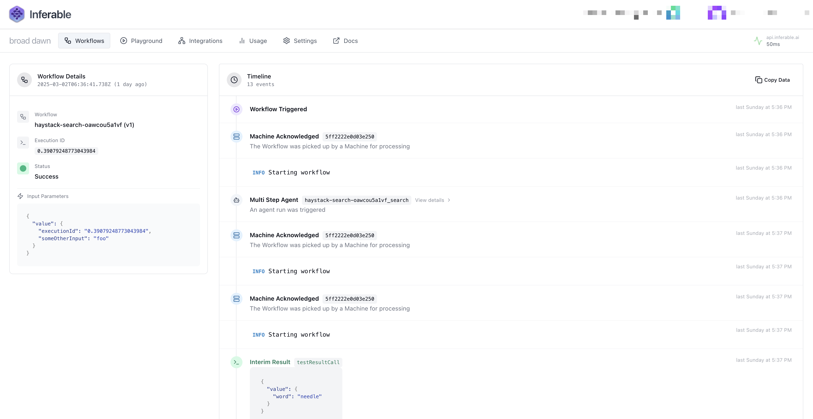

<div align="center">


# Inferable

Build reliable AI Workflows with humans in the loop

  


</div>

## What is Inferable?

Inferable is a managed durable execution runtime for creating AI workflows with humans in the loop. Create structured outputs from any LLM, ask humans for approval via Slack or Email, with versioned, long-running workflows for backwards compatibility.


## ⚡️ Quick Start

Follow the [quick start guide](https://docs.inferable.ai/pages/quick-start) to get started with Inferable.

## 🔑 Key Features

Here are some of the key features of Inferable.

### 📦 Workflows that execute in your own infrastructure

Workflows execute in your own infrastructure, even behind firewalls or private VPCs. No deployment step is required. We use long polling to connect to your infrastructure, so there is no need to open any inbound ports.

```typescript
const workflow = inferable.workflows.create({
  name: "simple",
  inputSchema: z.object({
    executionId: z.string(),
    greeting: z.string(),
  }),
});
```

### 🔄 Versioned Workflows for backward compatibility

When you need to change the input schema or the logic of a workflow, you can create a new version of the workflow. Inferable will maintain version affinity for currently executing workflows, so you can roll out new versions gradually. See [Workflows](https://docs.inferable.ai/pages/workflows).

```typescript
workflow.version(1).define(async (ctx, input) => {
  // ...
});

workflow.version(2).define(async (ctx, input) => {
  // ...
});
```

### 🧑‍💼 Human-in-the-Loop with approval workflows

Inferable allows you to integrate human approval and intervention with full context preservation. See [Human-in-the-Loop](https://docs.inferable.ai/pages/human-in-the-loop).

```typescript
deleteUserWorkflow.version(1).define(async (ctx, input) => {
  // ... existing workflow code ...

  if (!ctx.approved) {
    return Interrupt.approval({
      message: `I need your approval to delete the user ${input.userId}. Is this ok?`,
      destination: {
        type: "email",
        // The email address to notify
        email: "test@example.com",
      },
    });
  }

  await db.customers.delete({
    userId: input.userId,
  });
});
```

### 🏗️ Structured Outputs with automatic parsing, validation, and retries

Inferable automatically parses and validates structured outputs, and retries failed executions. See [Structured Outputs](https://docs.inferable.ai/pages/structured-outputs).

```typescript
workflow.version(1).define(async (ctx, input) => {
  const { ticketType } = ctx.llm.structured({
    input: `Ticket text: ${input.ticketText}`,
    schema: z.object({
      ticketType: z.enum(["data-deletion", "refund", "other"]),
    }),
  });

  // do something with the items
  console.log(ticketType);
});
```

And more stuff...

- [Notifications](https://docs.inferable.ai/pages/notifications) to send notifications to users via Slack or Email.
- [Memoized Results](https://docs.inferable.ai/pages/results) to cache the results of side-effects and expensive operations in a distributed way.
- [Obervability](https://docs.inferable.ai/pages/observability) in a timeline view, or plug into your own observability tools.
- [Agents](https://docs.inferable.ai/pages/agents) to create agents that can use tools to achieve pre-defined goals.
- Developer-friendly SDKs in [Node.js](./sdk-node/README.md), and [Go](./sdk-go/README.md) supported with more languages coming soon.



## 📚 Language Support

| Language             | Source                              | Package                                                          |
| -------------------- | ----------------------------------- | ---------------------------------------------------------------- |
| Node.js / TypeScript | [Quick start](./sdk-node/README.md) | [NPM](https://www.npmjs.com/package/inferable)                   |
| Go                   | [Quick start](./sdk-go/README.md)   | [Go](https://pkg.go.dev/github.com/inferablehq/inferable/sdk-go) |

## 🚀 Open Source

This repository contains the Inferable control-plane, as well as SDKs for various languages.

**Core services:**

- `/control-plane` - The core Inferable control plane service
- `/app` - Playground front-end and management console
- `/cli` - Command-line interface tool (alpha)

**SDKs:**

- `/sdk-node` - Node.js/TypeScript SDK
- `/sdk-go` - Go SDK
- `/sdk-dotnet` - .NET SDK (experimental)

## 💾 Self Hosting

Inferable is completely open source and can be self-hosted on your own infrastructure for complete control over your data and compute. This gives you:

- Full control over your data and models
- No vendor lock-in
- Enhanced security with your own infrastructure
- Customization options to fit your specific needs

See our [self hosting guide](https://docs.inferable.ai/pages/self-hosting) for more details.

## 🤝 Contributing

We welcome contributions to all projects in the Inferable repository. Please read our [contributing guidelines](./CONTRIBUTING.md) before submitting any pull requests.

## 📝 License

All code in this repository is licensed under the MIT License.
