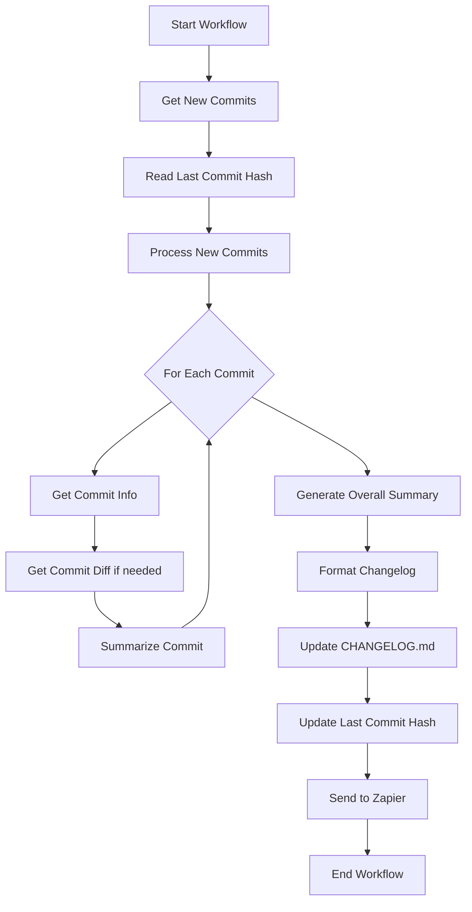

<div align="center">


</div>

# Changelog Generator Workflow

This demo showcases how to use Inferable workflows to create an automated changelog generator. The workflow analyzes git commits, summarizes changes, and automatically generates and updates a changelog while also integrating with Zapier for notifications.

This is also how we generate the changelog for Inferable.

## Features

- Automatically tracks and processes new commits since the last run
- Intelligently categorizes changes into fixes, features, and other types
- Generates human-readable changelog entries
- Integrates with Zapier for automated notifications
- Maintains a persistent changelog file
- Supports SDK-specific change tracking

## Tool Capabilities

### Git Tools

1. `getCommitInfo`

   - Gets detailed information about specific commits
   - Returns commit message, title, description, and changed files
   - Provides concise information for quick analysis

2. `getCommitDiff`
   - Retrieves the full diff for specific commits
   - Used sparingly due to potentially large response size
   - Provides detailed context when needed

### Workflow Agents

1. `summarizeCommit` Agent

   - Analyzes individual commits
   - Categorizes changes (fix/feature/other)
   - Extracts commit dates and descriptions
   - Uses AI to understand commit context

2. `summarizeCommits` Agent
   - Generates overall changelog summaries
   - Focuses on significant changes
   - Tracks SDK-specific changes
   - Determines version bumps for SDK releases

## Workflow Flow



## Setup Requirements

1. Environment Variables:

   - `INFERABLE_API_SECRET`: Your Inferable API key
   - `ZAPIER_WEBHOOK_URL`: Webhook URL for Zapier integration

2. File Structure:
   - Maintains `last-commit-hash.txt` for tracking processed commits
   - Updates `CHANGELOG.md` in the project root

## Usage

The workflow can be triggered using:

```typescript
inferable.workflows.trigger("summarize", {
  executionId: crypto.randomUUID(),
});
```

## Output Format

The generated changelog entries follow this structure:

- Overall summary of changes
- Categorized list of changes:
  - Bug fixes
  - New features
  - SDK releases
  - Other changes
- Each entry includes:
  - Change type
  - Description
  - Date of change

The changelog is automatically prepended to the existing CHANGELOG.md file, maintaining a historical record of all changes.

## Example Changelog Entries

The following are some example changelog entries generated by this workflow:

1. **CHANGELOG.md**: The project maintains a detailed changelog file that is automatically generated using this workflow.

2. **Twitter Updates**: Follow [@inferablehq](https://x.com/inferablehq) on Twitter/X for real-time updates, announcements, and tips about new features and improvements.
