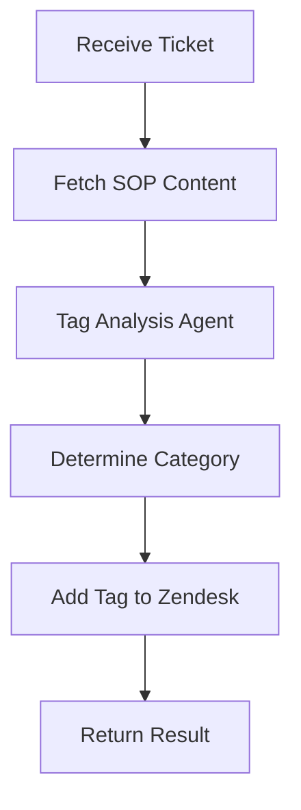

# Contextual Ticket Tagging Workflow

<div align="center">

</div>

This demo showcases how to use Inferable workflows to automatically tag Zendesk support tickets based on their content and Standard Operating Procedures (SOP). The workflow demonstrates how to create a simple but effective ticket classification system using AI agents and external integrations.

## Features

- Analyzes ticket content against SOP guidelines
- Uses AI to determine appropriate ticket categories
- Automatically adds tags to Zendesk tickets
- Supports multiple tag categories (general, refund, tech-support, billing, feature-request)
- Integrates with external SOP documentation

## Implementation Components

### Tools

This workflow doesn't use any tools. Instead, it demonstrates a specific pattern for tool orchestration where tools are implemented as utility functions and called directly within the workflow control flow, rather than being orchestrated by the AI agent. This is different from the [contextual-ticket-tagging](../contextual-ticket-tagging) demo, where the agent orchestrates the tools.

**Pattern Overview**

1. Tools are defined as regular async functions in `utils.ts`
2. The workflow explicitly calls these tools using `ctx.result()` wrapper
3. The AI agent focuses purely on analysis and decision making

**Tradeoffs**

**Advantages:**

- More explicit control flow with complete visibility into operation sequence
- Easier debugging since tool calls are in the workflow code
- Type safety through regular TypeScript functions
- Simpler agent focused solely on analysis and decision making

**Disadvantages:**

- Less flexibility as the agent can't dynamically decide tool usage
- More boilerplate with manual orchestration code
- Less resilient to changes in the tool interface
- Less autonomous agent behavior, where it can retry based on incorrect inputs

### Workflow Agent

The workflow uses a specialized `tagAnalysisAgent` that:

- Acts as a ticket classification specialist
- References company SOP documentation
- Analyzes ticket text against guidelines
- Determines the most appropriate tag category
- Supports 5 primary tag categories:
  - general
  - refund
  - tech-support
  - billing
  - feature-request

## Workflow Flow



### Response Format

The workflow returns:

```typescript
{
  success: boolean,
  tag: "general" | "refund" | "tech-support" | "billing" | "feature-request"
}
```

## Integration Details

### Zendesk Integration

- Uses Zendesk REST API
- Requires API token for authentication
- Updates ticket tags via PUT request
- Endpoint: `${ZENDESK_API_URL}/tickets/${ticketId}/tags`

### SOP Integration

- Fetches from configurable external URL
- Used as reference material for classification
- Helps maintain consistency with company guidelines
