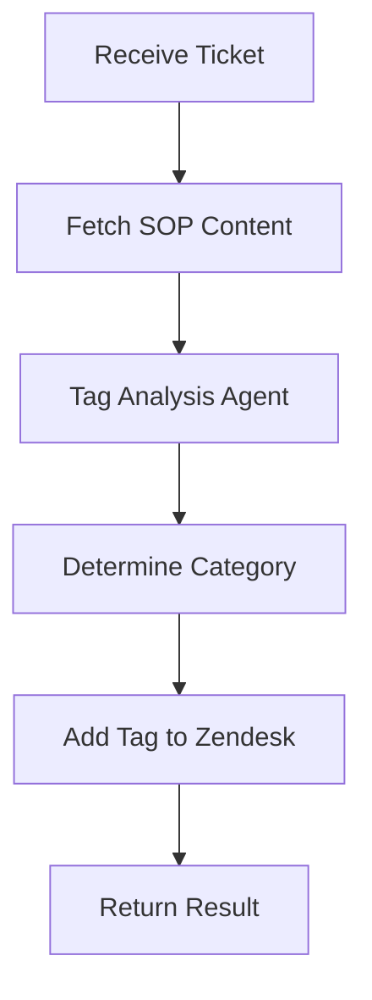

# Contextual Ticket Tagging Workflow

<div align="center">

</div>

This demo showcases how to use Inferable workflows to automatically tag Zendesk support tickets based on their content and Standard Operating Procedures (SOP). The workflow demonstrates how to create a simple but effective ticket classification system using AI agents and external integrations.

## Features

- Analyzes ticket content against SOP guidelines
- Uses AI to determine appropriate ticket categories
- Automatically adds tags to Zendesk tickets
- Supports multiple tag categories (general, refund, tech-support, billing, feature-request)
- Integrates with external SOP documentation

## Implementation Components

### Tools

1. `fetchSOPContent`

   - Fetches Standard Operating Procedures from external URL
   - Used as reference for ticket classification
   - Configured via `SOP_URL` environment variable

2. `addTagToTicket`
   - Adds tags to Zendesk tickets via API
   - Supports single tag addition per call
   - Uses Zendesk API for ticket updates

### Workflow Agent

The workflow uses a specialized `tagAnalysisAgent` that:

- Acts as a ticket classification specialist
- References company SOP documentation
- Analyzes ticket text against guidelines
- Determines the most appropriate tag category
- Supports 5 primary tag categories:
  - general
  - refund
  - tech-support
  - billing
  - feature-request

## Workflow Flow



### Response Format

The workflow returns:

```typescript
{
  success: boolean,
  tag: "general" | "refund" | "tech-support" | "billing" | "feature-request"
}
```

## Integration Details

### Zendesk Integration

- Uses Zendesk REST API
- Requires API token for authentication
- Updates ticket tags via PUT request
- Endpoint: `${ZENDESK_API_URL}/tickets/${ticketId}/tags`

### SOP Integration

- Fetches from configurable external URL
- Used as reference material for classification
- Helps maintain consistency with company guidelines
