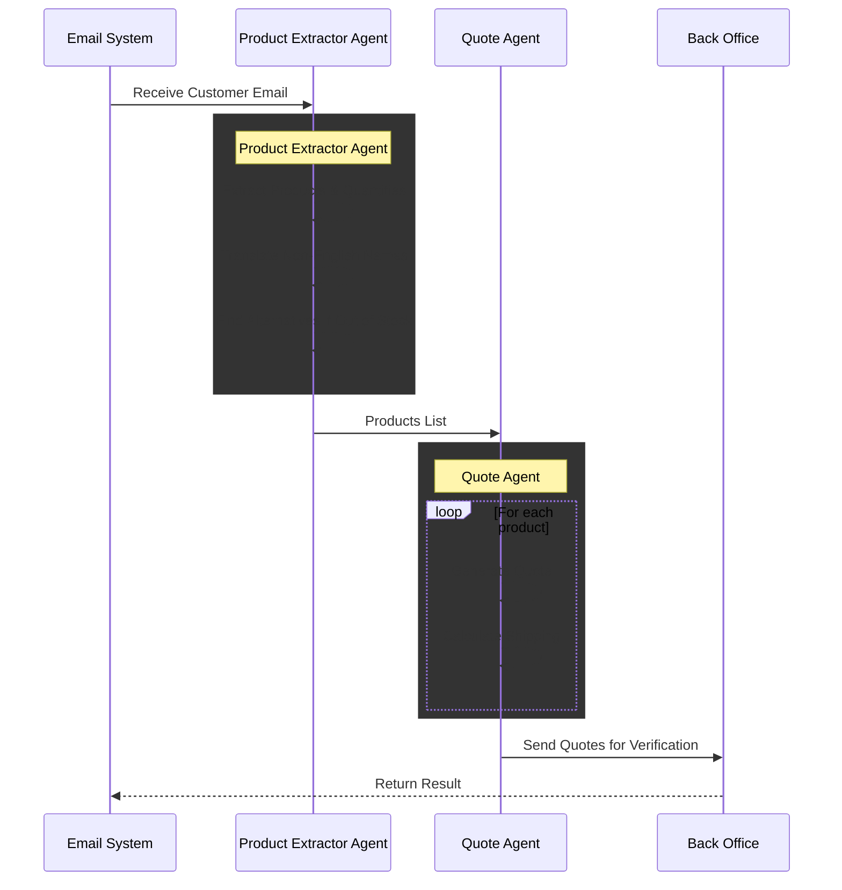

# Quote System Demo

<div align="center">

</div>

This demo showcases how to build a quote generation system using Inferable. The system processes customer email requests for product quotes, extracts relevant information using AI, and generates appropriate quotes.

## Features

- Email parsing using AI to extract product details and quantities
- Product search in a simulated back-office system
- Quote generation with customizable parameters
- Automated email notifications to back office staff
- Support for special delivery requirements
- Bulk quote processing capabilities

## Implementation Components

### Tools

1. `searchProduct`

   - Searches product database for details
   - Returns pricing, availability, and specifications
   - Supports fuzzy matching for product names

2. `generateQuote`

   - Creates quote based on product and quantity
   - Applies business rules for pricing
   - Handles special delivery requirements
   - Returns quote ID, pricing, and delivery estimates

3. `translateProductNames`

   - Translates product names to English from other languages
   - Detects source language
   - Provides translation confidence scores

4. `getProductAlternatives`

   - Finds alternative products when requested items are out of stock
   - Returns compatible product suggestions
   - Includes availability status

5. `getShippingCost`

   - Calculates shipping costs based on product and quantity
   - Provides estimated delivery timeframes
   - Supports different shipping providers
   - Factors in quantity-based scaling

6. `calculator`
   - Performs basic mathematical operations (add, subtract, multiply, divide)
   - Supports array of numeric values
   - Used for precise calculations in quote generation

### Workflow Agents

The workflow uses two specialized agents:

1. `productExtractorAgent`:

   - Analyzes customer email content
   - Identifies distinct products and quantities
   - Translates non-English product names
   - Finds alternative products when items are out of stock
   - Uses tools: searchProduct, translateProductNames, getProductAlternatives

2. `quoteAgent`:
   - Generates quotes for individual products
   - Calculates shipping costs
   - Performs precise mathematical calculations
   - Uses tools: generateQuote, getShippingCost, calculator

## Workflow Flow



## Setup Requirements

1. Environment Variables:

   - `INFERABLE_API_SECRET`: Your Inferable API key
   - `BACK_OFFICE_EMAIL`: Email for quote notifications
   - `PRODUCT_DB_URL`: URL to product database

2. Required Dependencies:
   - Inferable SDK
   - Email processing libraries
   - Product database connector

## Project Structure

- `src/index.ts` - Main entry point and workflow trigger
- `src/tools.ts` - Tool definitions for product search
- `src/workflow.ts` - Workflow definition for quote request processing
- `src/utils.ts` - Utility functions for email notifications

## Example Usage

The demo includes an example trigger in `index.ts`:

```typescript
inferable.workflows.trigger("quoteRequest", {
  executionId: `${hashOfTheEmailBody}`,
  customerEmail: "customer@example.com",
  emailBody: "I need a quote for 5 Enterprise Widgets with rush delivery, and 2 Premium Gadgets",
  backOfficeEmail: "quotes@company.com",
});
```

## Response Format

The workflow returns:

```typescript
{
  success: boolean,
  quotes: Array<{
    quoteId: string,
    productDetails: {
      id: string,
      name: string
    },
    shippingCost: number,
    totalPrice: number
  }>,
  customerEmail: string
}
```
